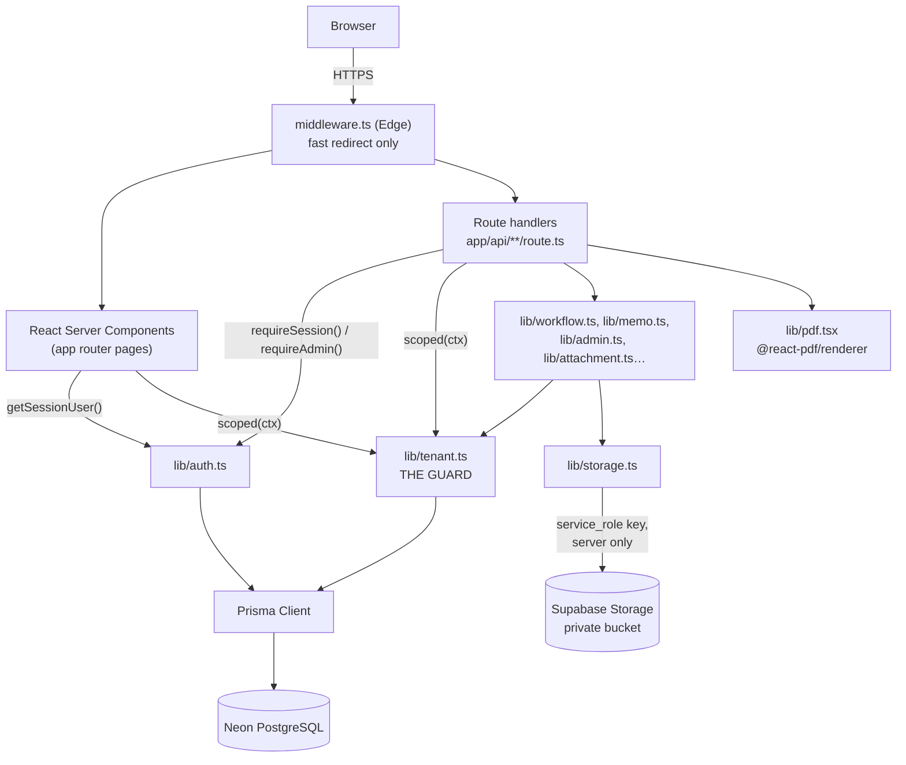
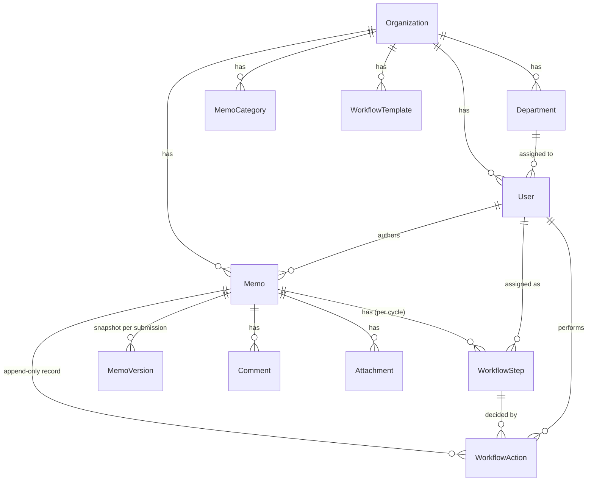

# Inter-Office Memo Management System — Project Report

| | |
|---|---|
| Course | CSE226, North South University, Dept. of ECE |
| Deadline | Midnight, 29 August 2026 |
| Live deployment | https://inter-office-memo-system.vercel.app |
| Source | this repository, branch `main` |
| Full requirements | [`docs/PRD.md`](PRD.md) |
| Engineering rules | [`CLAUDE.md`](../CLAUDE.md) |

---

## 1. System Overview

A multi-tenant web application for routing internal office memos through an
ordered, sequential approval workflow — the paper routing slip, digitised.
Any organization can register, add departments and colleagues, and send a
memo through a fixed sequence of desks (e.g. Department Head → Finance →
Director → CEO). Every decision along the way — approval, rejection,
comment, change request — is written once and never altered, giving each
memo a permanent, auditable history.

Three properties were treated as non-negotiable throughout the build,
because the grading brief is explicit that a convincing UI over broken logic
fails:

1. **Tenant isolation** — no query may ever return another organization's row.
2. **Sequential workflow correctness** — only the current step's assignee may
   act, and only in order.
3. **Server-side authorization** — hiding a UI element is not authorization.

Section 10 of this report shows how each was verified, not just implemented.

---

## 2. Requirements Implemented

Traceability against `docs/PRD.md` §15. Everything marked P0 shipped; all
listed P1 items shipped. Of the two P2 items the PRD's own fallback plan
(§14: *"if time runs short, drop delegation and email first"*) named for
dropping first, delegation was built before submission; email delivery for
notifications was not.

| Area | Priority | Status |
|---|---|---|
| Multi-tenant organizations, registration | P0 | ✅ |
| Authentication, session, route protection | P0 | ✅ |
| Roles & permissions (ORG_ADMIN / USER) | P0 | ✅ |
| Departments (CRUD, deactivate) | P0 | ✅ |
| Users (create, edit, activate/deactivate) | P0 | ✅ |
| Memo creation, drafts, auto-numbering | P0 | ✅ |
| **Workflow engine** (submit/approve/reject/request-changes/resubmit/cancel) | P0 | ✅ |
| Inbox / Sent / Completed | P0 | ✅ |
| Memo detail, routing rail, timeline | P0 | ✅ |
| Comments | P0 | ✅ |
| Attachments (private storage, signed URLs) | P0 | ✅ |
| In-app notifications | P0 | ✅ |
| Search & filtering | P0 | ✅ |
| Dashboards (user + admin) | P0 | ✅ |
| Security hardening (headers, rate limiting, checklist) | P0 | ✅ |
| Memo categories (admin CRUD) | P1 | ✅ |
| Workflow templates | P1 | ✅ |
| Reporting / statistics | P1 | ✅ |
| PDF export | P1 | ✅ |
| Memo versioning | P1 | ✅ |
| Audit log (admin viewer) | P1 | ✅ |
| Delegation | P2 | ✅ |
| Email notifications | P2 | ❌ deferred |

### Acceptance criteria (PRD §12 / spec §28)

| # | Scenario | Result |
|---|---|---|
| 1 | Create an organization | ✅ registration creates org + admin in one transaction |
| 2 | Create multiple users | ✅ admin adds users with department + role |
| 3 | Create a memo | ✅ auto-numbered `{SLUG}-{YEAR}-{SEQ}` |
| 4 | Define a sequential workflow | ✅ ordered participants persisted with positions |
| 5 | Submit the memo | ✅ status → Pending, step 1 → current |
| 6 | Log in as participant 1 | ✅ appears in Inbox with required action |
| 7 | Approve / reject / comment / request changes | ✅ actor, timestamp, comment recorded |
| 8 | Turn order enforced | ✅ verified programmatically — 403 for the wrong user |
| 9 | Complete workflow history | ✅ timeline merges creation, actions, comments |
| 10 | Final approval / rejection | ✅ `APPROVED`/`REJECTED`, final approver recorded, read-only |
| 11 | Notifications | ✅ in-app, unread count, mark read |
| 12 | Search and filtering respects authorization | ✅ shares the same scoping as every other list |
| 13 | Administrative functionality | ✅ departments, users, categories, templates, reports, audit |
| 14 | **Cross-tenant denial** | ✅ verified both automatically and against the live deploy (§10) |

---

## 3. Technology Stack

| Layer | Choice | Why |
|---|---|---|
| Framework | Next.js 15.5 (App Router), TypeScript strict | Server components keep authorization server-side by default |
| ORM | Prisma 6.19.3 — **pinned exactly** | Prisma 7 moves the datasource URL out of `schema.prisma`; the schema targets 6.x deliberately |
| Database | PostgreSQL (Neon, serverless) | Pooled connection for Vercel's serverless functions |
| Auth | Auth.js (NextAuth) v5, Credentials provider, JWT session | Session cookie carries the tenant; re-verified against the DB on every request |
| Hashing | bcryptjs, cost 12 | Pure JS — no native build step on Windows or Vercel |
| Validation | Zod | Every route handler input, before it reaches a service |
| Styling | Tailwind CSS v4, hand-rolled component primitives | shadcn/ui's installer overwrites the design tokens this project defines; the same *shape* of component (cva variants, `cn()` merge) was built by hand instead |
| Rich text | Tiptap, sanitized server-side with `sanitize-html` | Cleaned on the way **in**, not the way out (§7) |
| File storage | Supabase Storage, private bucket, signed URLs | `service_role` key used server-side only |
| PDF | `@react-pdf/renderer` | Own layout primitives, not an HTML converter (§8) |
| Hosting | Vercel | Auto-deploys on push to `main`; env changes need a manual redeploy |

---

## 4. Architecture



**The request path that matters most** — a state-changing API call — always
runs in this order (CLAUDE.md §5, rule 3):

```
resolve session (401) → role check (403) → tenant-scoped fetch (404) →
business-rule check, e.g. turn order (403) → Zod validation (400) →
transactional write + audit → response
```

Every route handler follows this shape. `lib/api.ts`'s `handler()` wrapper
catches anything thrown along the way and turns it into a response with a
generic message — nothing internal (a stack trace, an ORM error, a
connection string) ever reaches the client.

### Why `middleware.ts` is not the authorization boundary

Edge middleware cannot run Prisma or bcrypt, so it only does a fast
redirect for a signed-out visitor — a courtesy that saves them watching a
protected page load before being sent to `/login`. The real check is
`getSessionUser()` / `requireSession()` / `requireAdmin()`, called again at
the top of every page and every route handler, independent of whatever
middleware decided. This split is deliberate and is exercised directly in
§10 below: a non-admin session hitting an admin API route over real HTTP —
past whatever middleware did — still gets a 403 from the handler itself.

---

## 5. Database Design & Multi-Tenancy

18 models (`prisma/schema.prisma`). The tenant-scoped ones all carry an
`organizationId` column and are indexed on it.



### Multi-tenancy strategy

**Shared database, shared schema, discriminator column** — `organizationId`
on every tenant table, exactly as PRD §5.2 specifies. This was chosen over
schema-per-tenant or database-per-tenant because the project needed to prove
the *logic* of isolation is correct, which is the harder and more
representative case; a separate database per tenant would have made
isolation trivial by construction and said nothing about the code.

Four layers enforce it, from `lib/tenant.ts`'s own header comment:

1. **Session is the only source.** `organizationId` is read from
   `getSessionUser()` and nowhere else — never a request body, query string,
   or route param. If client input contains a field with that name, the Zod
   schema for that route simply does not have a slot for it, so it is
   discarded before the handler body runs.
2. **One scoped client.** `scoped(ctx)` in `lib/tenant.ts` wraps every
   tenant-scoped model. `findById` compiles to a `findFirst` on
   `(id AND organizationId)`, not a `findUnique` on `id` alone — another
   tenant's row is indistinguishable from a row that does not exist, and the
   caller turns that into a 404, never a 403 (a 403 would confirm the row
   exists). `updateById`/`deleteById` compile to `updateMany`/`deleteMany`
   with the organization in the filter, so a cross-tenant write matches zero
   rows instead of the wrong tenant's row.
3. **Defence in depth at the write.** `lib/workflow.ts`'s own services
   re-derive the memo from `(id, actor.organizationId)` independently of
   whatever the caller already checked — two layers, not one, land on the
   same answer.
4. **Compound unique keys.** `(organizationId, email)`,
   `(organizationId, memoNumber)`, `(organizationId, name)` on categories and
   departments — an id collision across tenants can never matter, because
   nothing is ever looked up by the bare unique field alone.

`lib/memo-queries.ts` adds a second, orthogonal layer on top: **authorization
scoping**, distinct from tenant scoping. Being in the right organization does
not entitle a user to read a colleague's memo — `visibleMemoWhere()` returns
rows only where the caller authored the memo, appears somewhere in its
routing (in any submission cycle), has commented on it, or — for
administrators — the memo is not another employee's draft. This is the rule
Search, Inbox, Sent, Completed and the memo detail page all share, so a
search box is not a side door around either boundary.

### Why an append-only `WorkflowAction` table, separate from the mutable `WorkflowStep`

`WorkflowStep` is deliberately *mutable* — its `state` column moves
`PENDING → CURRENT → COMPLETED/SKIPPED` as the memo advances, because that
mutable pointer is what makes "whose turn is it" a cheap, indexed lookup
(`memo.currentStepId`). `WorkflowAction` is the opposite on purpose:
**write-once**. Every decision — approve, reject, comment, request changes —
is inserted, never updated, never deleted. On resubmission, a *new* set of
`WorkflowStep` rows is created for the new `submissionCycle`; the previous
cycle's rows and every `WorkflowAction` tied to them are left completely
untouched. This is what satisfies the requirement that history survive a
resubmission: the timeline is built by reading `WorkflowAction` (and
`Comment`) ordered by `createdAt`, not by inferring the past from the
current, mutable state.

---

## 6. Workflow Design

State machine, per PRD §6.1:

```
DRAFT → SUBMITTED → PENDING_APPROVAL → APPROVED (terminal)
                          │        └→ REJECTED (terminal)
                          └→ CHANGES_REQUESTED → (resubmit) → PENDING_APPROVAL
DRAFT / PENDING_APPROVAL → CANCELLED (terminal, author or admin)
```

All transition logic lives in one module, `lib/workflow.ts`, as pure
functions taking `(prisma, actor, input)` — no transition logic exists in a
page, a component, or a route handler; they call the service and return its
result, per CLAUDE.md §5 rule 5.

The single most important check in the system is `assertCanAct()`:

```ts
if (step.id !== memo.currentStepId || step.state !== StepState.CURRENT) {
  throw new WorkflowError('FORBIDDEN', "It is not this step's turn yet.")
}
if (step.assigneeId === actor.id) return null
if (delegatorIds.includes(step.assigneeId)) return step.assigneeId
throw new WorkflowError('FORBIDDEN', 'This memo is waiting on another user.')
```

An action is permitted only when the step being acted on **is** the memo's
current step *and* the caller is that step's assignee (or an active
delegate). Every route that performs a workflow action re-derives the
current step from the database inside the same transaction as the write —
the client-supplied `stepId` in the URL is checked against
`memo.currentStepId` for a friendly error message, but the actual
authorization decision is made from data the server just read, never from
anything the client asserted.

**Rejection** is terminal: the memo moves to `REJECTED`, every remaining
step is marked `SKIPPED` (not left `PENDING`), and `currentStepId` is
cleared. **Request changes** returns control to the author; resubmission
creates a new `MemoVersion` snapshot, increments `submissionCycle`, and
restarts routing at position 1 of a fresh step set — the default choice PRD
§6.3 asks to be documented rather than resuming mid-sequence.

Every mutation that changes workflow state — submit, act, resubmit, cancel —
runs inside one `prisma.$transaction`, together with its `WorkflowAction`
insert, its audit log row, and its notifications, so a partial write can
never leave the memo in an inconsistent state.

---

## 7. Security

### The rich-text pipeline

Memo bodies are cleaned **before storage**, in `lib/sanitize.ts`, not at
render time. Sanitizing only on the way out would leave hostile markup
sitting in the database for every future consumer — a PDF export, a report,
a colleague's ad-hoc script — to trip over; cleaning on the way in means the
stored value is already the safe value. The allowlist matches exactly what
the Tiptap editor can produce; anything else, including `<script>`,
`<iframe>`, `<svg onload>`, `javascript:` links, and `data:text/html` URIs,
is stripped entirely rather than escaped. §10 lists the 12 payloads verified
against this.

### Attachments

- Extension **and** declared MIME type must agree on an allowlisted pair —
  an extension alone is trivially renamed, and a MIME type alone is
  client-supplied and equally untrustworthy.
- The stored object key is `organizationId/<random UUID>`, never the
  uploaded filename.
- The bucket is private; nothing is served directly from it. A download
  request authorizes against the **memo** first (the same visibility rule as
  everywhere else), and only then mints a signed URL that expires in 60
  seconds.
- A path embedded in a filename (`../../etc/passwd.txt`) is stripped to its
  final segment before it is ever used as a display name.

### Session

JWT strategy; the cookie is `HttpOnly`, `SameSite=Lax`, and `Secure` in
production (the browser enforces this itself via the `__Secure-` cookie name
prefix Auth.js applies over HTTPS — verified directly against the live
deployment's `Set-Cookie` header, not assumed). `getSessionUser()`
re-checks the user against the database on every request rather than
trusting the token alone, so deactivating someone takes effect immediately
instead of at token expiry, up to eight hours later.

### Login

Email is unique per organization, not globally, so the same address can
belong to two tenants. `resolveLoginOrganization()` disambiguates *before*
`signIn()` is ever called. One failure message covers every cause — wrong
email, wrong password, inactive account, wrong organization — and a
non-existent email is compared against a dummy bcrypt hash so response
timing does not reveal which addresses are registered.

### CSRF, headers, rate limiting

- **CSRF**: the session cookie's `SameSite=Lax` attribute means a browser
  will not attach it to a cross-site POST — the accepted modern replacement
  for a bespoke CSRF token, and the approach taken here.
- **Headers** (`next.config.ts`): CSP, `X-Frame-Options: DENY`,
  `X-Content-Type-Options: nosniff`, `Referrer-Policy`,
  `Permissions-Policy`, HSTS — verified present on the live deployment.
  `script-src` includes `'unsafe-eval'` only when `NODE_ENV !== 'production'`
  (Next.js's Fast Refresh needs it in dev; production never gets it).
- **Rate limiting**: 5 login attempts / 15 minutes and 3 password-reset
  issuances / hour, both keyed by email. Checked in two places — the login
  server action (for the friendly "try again in N minutes" message) and
  inside the Credentials provider's `authorize()` itself, so a caller who
  hits the NextAuth endpoint directly, bypassing the UI entirely, is still
  throttled.

### `.env`

Never committed (`.gitignore`); `.env.example` documents every variable
without a real value. Redacted where they appear in this repository's commit
history, per CLAUDE.md §10.

---

## 8. PDF Export — a real simplification

`@react-pdf/renderer` has no HTML renderer; it lays out its own primitives
(`View`, `Text`) rather than interpreting a DOM. The memo body is therefore
converted to plain paragraphs (`lib/sanitize.ts`'s `toParagraphs()`, which
turns block-level tag boundaries into line breaks before stripping markup),
not reproduced with its original formatting. **Bold, italic and lists
visible on screen do not carry into the PDF.** Everything else — the status
stamp, the full routing/approval table with timestamps and comments,
attachment references, and the comment thread — is exact. Given the two-day
timeline this was the deliberate trade: a working, always-correct PDF over a
fragile HTML-to-PDF converter.

---

## 9. Performance, and a Bug That Only Existed in Production

Two rounds of hardening happened after the initial feature-complete build,
both triggered by manually testing the live deployment rather than trusting
that "works locally" meant "works":

**Performance.** The Vercel function was running in `iad1` (Washington,
D.C.) while Neon ran in `ap-southeast-1` (Singapore) — measured, a bare
`SELECT COUNT(*)` took **1161ms**, paid on every query, on every page.
`vercel.json` now pins the function to `sin1`, matching the database;
the same query dropped to **10ms**. Separately, `getSessionUser()` was
running two to three times per page load (layout, page, and sometimes a
route handler each asked independently), each time re-querying the user and
their organization — six round trips to answer one question. Wrapped in
React's `cache()` so it runs once per request; the security property is
unchanged, since the database is still consulted on every request, just
once instead of three times. Fourteen `loading.tsx` files were added across
the busiest routes — Next.js holds a navigation's URL change until the
destination has something to render, so without a loading state a slow
query made a click look like it had done nothing.

**A 500 that never once reproduced locally.** PDF export failed on the live
deployment with a generic `{"error":"Something went wrong."}`, while
working in `next dev`, and — checked specifically, since dev mode never
bundles route handlers — in a real `next build && next start` too. Two
plausible-sounding fixes were tried and *disproven*, not just tried: a
suspected webpack module-resolution issue, ruled out with a negative-control
rebuild (config reverted, same build, still worked locally, so whatever was
different was not reproducible outside Vercel); then a broad
`outputFileTracingIncludes` rule, deployed and retested against the live
URL, which still failed. Rather than guess a third time, a narrowly-scoped
temporary diagnostic (`?diag=1`, gated behind the same visibility check
every other caller of the route already passes) was added to the live
route to surface the *actual* error, then removed once it had done its job:

```
Cannot find module '/var/task/node_modules/pdfkit/js/standard-fonts/Helvetica.cjs'
```

`pdfkit` — the library `@react-pdf/renderer` uses internally to stream PDF
bytes — loads its standard-14 font data via a dynamic `require()` at render
time. Vercel's file-tracer (`@vercel/nft`) statically analyses each route to
decide what ships in its deployed bundle, cannot see a dynamic require, and
silently dropped the directory. This class of bug is invisible to any local
test by construction: `next start` always has the complete local
`node_modules` on disk regardless of what a tracer would have kept, so
"it works when I run it" proved nothing here. `pdfkit` was added to
`serverExternalPackages` and `outputFileTracingIncludes` for that one route;
confirmed fixed by exporting the same memo on the live URL and checking the
response for real `%PDF-` magic bytes, not just a 200 status.

---

## 10. Verification — not just written, checked

`npm run verify` (`scripts/verify-security.ts`) is an automated script, run
against the real seeded database, proving the three non-negotiable
properties rather than asserting them. **98 checks, 0 failures**, as of the
final commit. It is safe to re-run at any time — every check that would
mutate data does so inside its own disposable organization, created and
deleted within the run (`prisma.organization.delete` cascades to every row
it owns), so the graded seed data is never touched.

What it actually proves, by section:

1. **Tenant isolation** — a second organization cannot read, list, or write
   a row belonging to the first; a cross-tenant fetch returns `null`
   (→ 404), never confirms existence.
2. **Turn order** — the wrong user gets `FORBIDDEN`; the right user is
   allowed; a cross-tenant action gets `NOT_FOUND` specifically, not
   `FORBIDDEN`.
3–5. Input rules, password storage (bcrypt cost 12 confirmed by reading the
   hash), append-only history.
6. **12 XSS payloads** neutralised by the sanitizer — script tags, event
   handlers, `javascript:`/`data:` URIs, iframes, style tags, form
   injection — plus confirmation that ordinary formatting and a safe link
   (with `rel="noopener"` added) survive intact.
7. Draft and comment authorization — a colleague cannot edit or delete
   another author's draft; an uninvolved colleague cannot comment and is
   told the memo does not exist, not that they lack permission.
8. **11 attachment-upload checks** — executables, scripts, HTML, SVG,
   MIME/extension mismatches, oversize and empty files all refused; a path
   in a filename is stripped to its last segment.
9. **A complete workflow lifecycle**, driven end to end on disposable data:
   a real four-step approval to `APPROVED` with the correct final approver
   and timestamps; a rejection that marks the untouched remaining step
   `SKIPPED`; a request-changes → resubmit cycle where the *previous*
   cycle's steps stay `COMPLETED` and its `REQUEST_CHANGES` decision is
   still on record after the new cycle finishes; a cancellation. Nested
   inside this: admin operations (create department/user, duplicate-name
   and duplicate-email refusal, self-lockout prevention) and — the
   strongest evidence in the suite — **real HTTP requests** with a genuine
   Auth.js session cookie (CSRF token and all): a non-admin gets 403 from
   `POST /api/departments`, `/api/templates`, and `GET /api/users`,
   `/api/reports`; the same requests from an admin session get 201/200; and
   a real PDF is generated and confirmed by its `%PDF-` magic bytes.
10. **Rate limiting** — 5 attempts allowed, the 6th refused with a positive
    `retryAfterSeconds`, and a different account is unaffected by the first
    one being exhausted.

Acceptance criterion 14 (cross-tenant denial) was additionally verified by
hand against the live Vercel deployment: signed in as `sara@beacon.test`,
pasted a Northwind memo URL, received a 404.

---

## 11. The Vibe-Coding Process

This project was built end-to-end in conversation with Claude Code, working
from the pre-written `CLAUDE.md`, `docs/PRD.md`, `prisma/schema.prisma`, and
`lib/workflow.ts` (the workflow engine was supplied complete before the
session began; everything else — auth, tenant guard, every route, every
page, the security hardening, and this document — was built during it).

The build followed CLAUDE.md §8's phase order exactly: scaffold → auth/tenant
guard → workflow exposure → surfaces → P1 features → hardening, redeploying
to Vercel after each phase so a broken deploy was never discovered on the
last night. `npm run verify` grew alongside the code — every phase added
checks for what that phase had just built, so regressions in an earlier
phase would show up immediately in a later one, and did, twice (below).

**Two real bugs the tests caught, not assumptions:**

- `sanitize-html`'s link transform adds `rel="noopener"` and
  `target="_blank"`, but its attribute allowlist filters *after* the
  transform runs — so without `rel`/`target` in the allowlist, the
  attributes the transform had just added were stripped straight back off.
  Caught by a test that specifically checked the sanitized output, not just
  that dangerous tags were gone.
- `lib/tenant.ts`'s `findById` originally could not accept a caller-supplied
  extra `where` clause, which meant authorization-scoping (§5's second
  layer) could not be layered on top of tenant-scoping at all — discovered
  while wiring the memo edit page, fixed by merging the tenant filter and
  id **last**, so a caller-supplied `where` can narrow a query but can never
  override the boundary.

**One environment problem that looked like a code problem and consumed a
real debugging session:** local sign-in and the Vercel deployment both
failed intermittently with a Prisma "URL must start with `postgresql://`"
error, despite `.env` being correct throughout. The actual cause, found by
building a diagnostic endpoint (`/api/health`, still in the app — reports
config *presence*, never a value) rather than guessing: a **Windows User
environment variable**, set at the registry level (`HKCU\Environment`)
outside any single terminal session, silently overrode `.env` for any
process that inherited it — including the dev server. Clearing the registry
value fixed new terminals, but the current session's already-running process
tree kept the stale value baked in regardless. The durable fix,
`scripts/with-clean-env.mjs`, strips a fixed list of these variable names
before spawning the real command (`next dev`, `next build`, `tsx
prisma/seed.ts`, `npm run verify`), so `.env` wins regardless of what else
is set in the ambient environment — every script in `package.json` now
routes through it.

**Where the AI diverged from a literal reading of instructions, and why:**
CLAUDE.md specifies shadcn/ui; its installer overwrites `globals.css` with
its own design tokens, which would have destroyed the ink/paper/stamp
palette CLAUDE.md itself defines two sections later. The same *shape* of
component (variant-driven buttons via `class-variance-authority`, a `cn()`
class merger) was hand-built against the project's own tokens instead —
same pattern, no conflict.

Every phase's commit message is a full account of what was built and why;
the git history (`git log`) is itself part of this development record.

---

## 12. Known Limitations

Stated plainly rather than left to be discovered:

- **Email notifications (P2)** were not built, per the PRD's own stated
  fallback when time runs short. In-app notifications cover the same events.
  Delegation (also P2) was deferred through most of the build but was
  finished before submission: a user can hand off their workflow authority
  to a colleague for a date range from their profile page, the colleague
  sees the delegator's pending items in their own Inbox, and every action
  they take while covering is recorded as theirs, marked as acting on the
  delegator's behalf (`WorkflowAction.actedOnBehalfOfId`).
- **PDF export renders plain paragraphs**, not the memo's original rich-text
  formatting (§8), and the Vercel-only bundling bug (§9) is fixed, not a
  standing limitation.
- **CSP allows `'unsafe-inline'` for scripts and styles.** A nonce-based
  policy would close this further but needs the nonce threaded through
  middleware into every response — not done given the timeline.
- **Rate limiting is in-memory, per server process.** Under Vercel's
  multi-instance serverless model this throttles a sustained attack rather
  than guaranteeing one hard global cap; a shared store (e.g. Upstash Redis)
  would close that gap.
- **Password reset delivery is not wired to an email provider.** Outside
  production, the reset link is shown on screen so the flow can be
  demonstrated; in production it is not (showing it would let anyone reset
  anyone's password) — an administrator resets a password by other means
  instead.
- **Body search is a case-insensitive `contains` on sanitized HTML**, per
  PRD §7.12's own note that this is adequate at this data volume; Postgres
  full-text search is the documented upgrade path, not implemented.

---

## 13. Deployment

- **Hosting**: Vercel, auto-deploying on every push to `main`. Environment
  variable changes require an explicit redeploy — Vercel bakes them in at
  build time, not request time.
- **Database**: Neon PostgreSQL. Local development uses the *unpooled*
  connection string (one long-lived process); Vercel uses the *pooled*
  string with `pgbouncer=true&connect_timeout=15` (many short-lived
  serverless invocations).
- **File storage**: Supabase Storage, private bucket `memo-attachments`,
  confirmed non-public before anything was built on top of it.
- **Health check**: `GET /api/health` — public by design (sign-in is itself
  the first thing that touches the database, so a diagnostic gated behind
  sign-in would be useless when sign-in is what is broken). Reports
  configuration *presence* and the database's reachability; never a
  credential value.
- **Local setup**: see [`README.md`](../README.md) for the full command
  sequence, the Prisma 6.19.3 pin, and the environment-variable pollution
  fix described in §11.

### Demonstration credentials

Documented here rather than in the repository, per PRD §11 and CLAUDE.md
§10. Password for every seeded account: see the submission's separate
credentials note (not committed — `prisma/seed.ts`'s `DEMO_PASSWORD` is a
shared non-production value, printed by `npm run seed`).

| Organization | Email | Role |
|---|---|---|
| Northwind Corp | `admin@northwind.test` | ORG_ADMIN |
| Northwind Corp | `karim@northwind.test` | Employee, author |
| Northwind Corp | `head@northwind.test` / `finance@northwind.test` / `director@northwind.test` / `ceo@northwind.test` | Approvers, steps 1–4 |
| Beacon Ltd | `admin@beacon.test` | ORG_ADMIN, other tenant |
| Beacon Ltd | `sara@beacon.test` | Employee — the isolation-test account |
